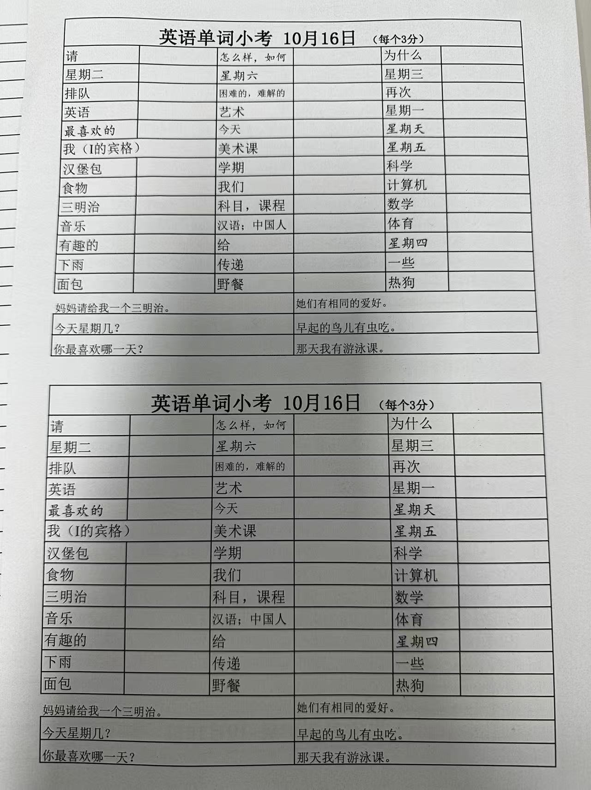
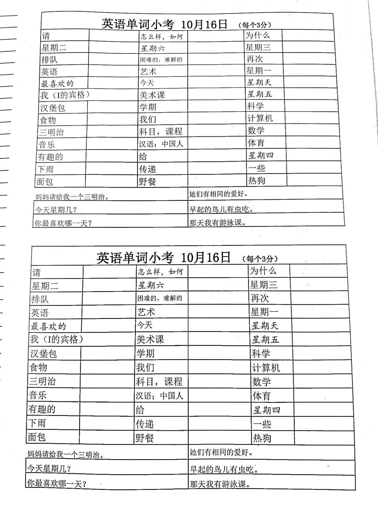
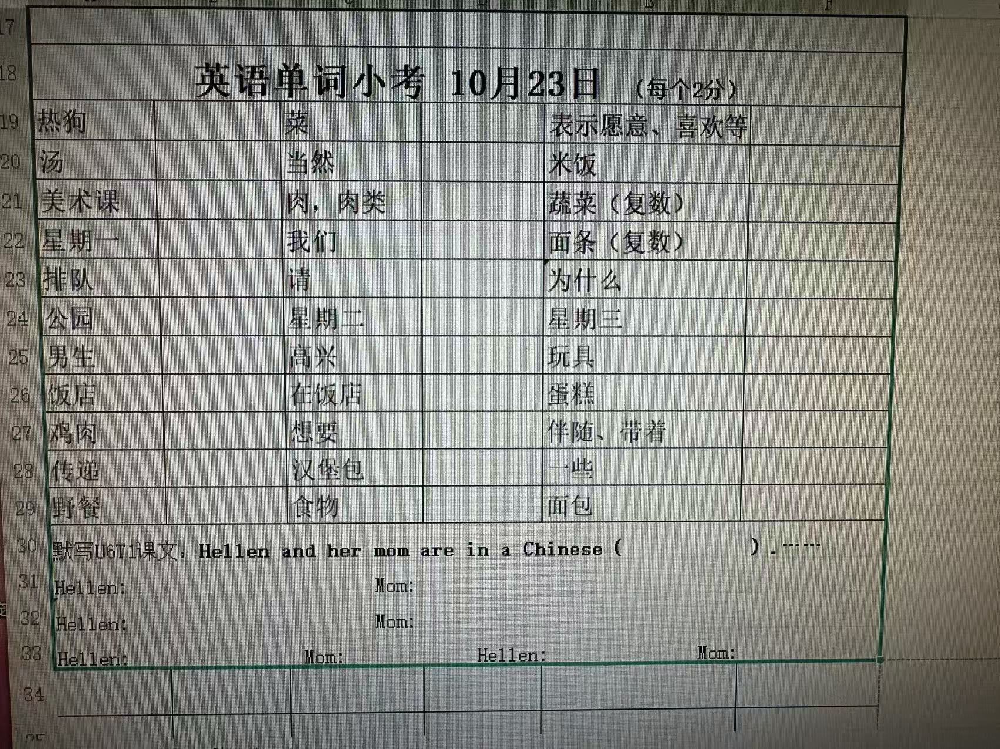
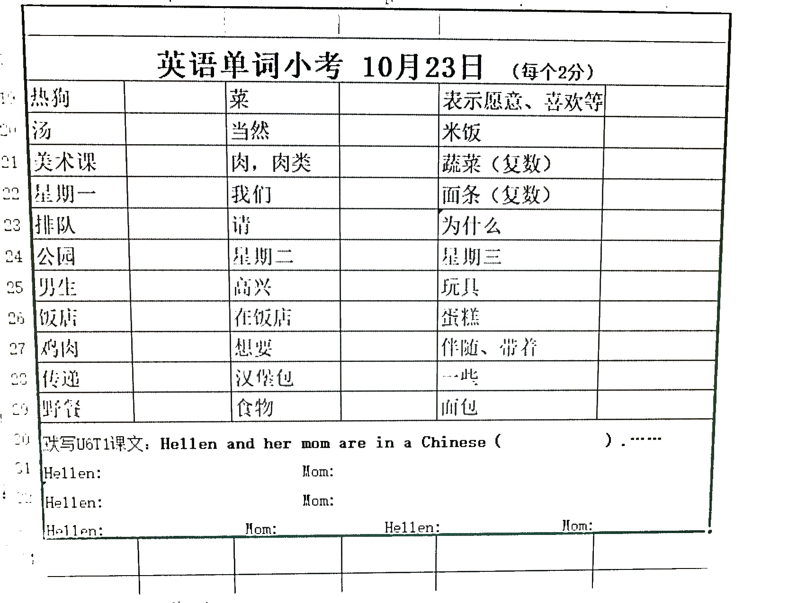

# 拍照图片去黑影工具 - V1.3

基于PyQt6开发的图片处理工具，提供多种图片处理功能，支持实时预览和智能保存。

## 版本信息
- **当前版本**：V1.3
- **主要改进**：优化处理效果，增加去除摩尔纹功能
- **界面优化**：简化样式表，使用纯色背景替代渐变效果
- **性能提升**：优化图像处理流程，避免重复操作

## 功能特点

- **拖拽支持**：支持拖拽图片文件到程序窗口
- **实时预览**：所有参数调整实时显示处理效果
- **智能保存**：自动添加时间戳，避免文件覆盖
- **多格式支持**：支持主流图片格式
- **现代化界面**：美观的深色主题界面设计

## 处理功能

### 基础处理功能
1. **对比增强**：调整图片对比度（0%-200%）
2. **亮度调节**：调整图片亮度（-100到100）
3. **清晰度调节**：增强图片清晰度（0%-100%）
4. **画面柔和**：应用高斯模糊效果（0-20）
5. **消除摩尔纹**

### 几何变换功能
6. **图片旋转**：旋转图片角度（-180°到+180°）
7. **四点变换**：透视变换，可调整四个角点的位置
8. **裁剪功能**：精确裁剪图片区域

## 处理效果样例

以下是使用本工具处理图片的前后对比效果：

### 样例1：手机拍照试卷图片
| 处理前 | 处理后 |
|--------|--------|
|  |  |

### 样例2：手机拍照显示器图片
| 处理前 | 处理后 |
|--------|--------|
|  |  |

**说明**：
- **处理前图片**：原始图片文件（如 `1.jpg`, `2.jpg`）
- **处理后图片**：经过本工具处理后的效果（如 `1_filter.jpg`, `2_filter.jpg`）

## 安装依赖

在运行程序前，请先安装所需的Python包：

```bash
pip install -r requirements.txt
```

### 依赖包版本
- PyQt6==6.6.1
- opencv-python==4.9.0.80
- numpy==1.26.0

## 使用方法

### 方法一：直接运行主程序
```bash
python image_processor.py
```

### 方法二：使用启动脚本
```bash
python run.py
```

## 操作说明

### 图片加载方式
1. **点击选择**：点击"选择图片"按钮选择图片文件
2. **拖拽加载**：直接将图片文件拖拽到程序窗口

### 参数调节
- 使用滑块调整各种处理参数
- 所有调整实时显示在右侧预览区域
- 支持同时应用多个处理效果

### 特殊功能操作

#### 四点变换（透视变换）
1. 打开"四点变换开关"
2. 分别调整四个角点的X/Y偏移量
3. 实现透视校正、梯形校正等效果

#### 裁剪功能
1. 打开"裁剪开关"
2. 分别调整左、上、右、下四个边界的裁剪比例
3. 精确裁剪图片区域

### 保存功能
- 点击"保存图片"按钮保存处理结果
- 自动添加时间戳格式：`_YYYYmmdd_HHMMSS`
- 示例：`image.jpg` → `image_20241225_143022.jpg`
- 支持PNG、JPEG等多种格式

## 支持的图片格式

- PNG (.png)
- JPEG (.jpg, .jpeg)
- BMP (.bmp)
- GIF (.gif)
- TIFF (.tif, .tiff)

## 界面布局

程序界面采用现代化设计，分为三个主要区域：

### 左侧区域 - 原始图片
- 图片选择和显示区域
- 支持拖拽操作
- 显示原始图片信息

### 右侧区域 - 处理结果
- 实时显示处理效果
- 保存功能按钮
- 支持图片缩放显示
### 下面区域 - 参数调节
- **基础处理**：对比度、亮度、清晰度、柔和、摩尔纹
- **几何变换**：旋转、四点变换、裁剪
- 所有滑块实时联动，效果即时预览


## 技术特性

### 核心算法
- **去阴影**：自适应阈值
- **透视变换**：四点变换矩阵计算
- **图片旋转**：仿射变换

### 稳定性优化（V1.3）
- **样式表简化**：纯色背景替代复杂渐变效果
- **绘图状态管理**：优化拖拽事件处理和窗口大小变化处理
- **数据独立性**：确保QImage使用独立数据，避免指针问题

### 用户体验
- **实时响应**：所有操作即时反馈
- **智能缩放**：自适应窗口大小
- **错误处理**：完善的异常处理机制
- **中文支持**：完整的中文界面和路径支持

## 保存功能特色

### 时间戳自动添加
- 格式：`_YYYYmmdd_HHMMSS`（如：`_20241225_143022`）
- 智能检测：避免重复添加时间戳
- 默认文件名：`processed_image_YYYYmmdd_HHMMSS.png`

### 文件格式支持
- 自动识别和保持原始格式
- 无扩展名时默认使用PNG格式
- 支持中文文件名和路径

## 注意事项

- 请确保安装了所有必需的依赖包
- 处理大尺寸图片时可能需要更多内存
- 四点变换功能需要打开开关才能生效
- 裁剪功能可以精确控制裁剪区域
- 保存时会保留原始图片质量

## 开发信息

- **开发语言**：Python 3.12
- **主要库**：PyQt6, OpenCV, NumPy
- **界面框架**：PyQt6
- **图片处理**：OpenCV
- **数学计算**：NumPy
